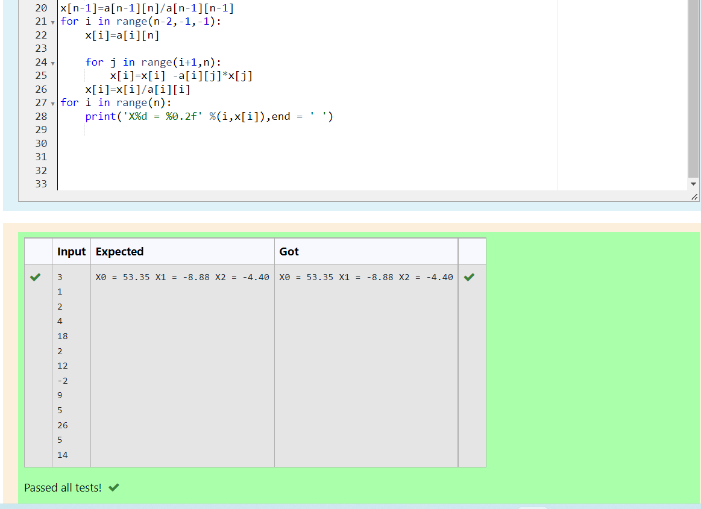

# EIGENVALUES-AND-EIGENVECTORS
## Aim:
To write a python program to find the Eigenvalues and Eigen Vectors
## Equipment’s required:
1. 	Hardware – PCs
2. 	Anaconda – Python 3.7 Installation / Moodle-Code Runner
## Algorithm:
### Step1 :  
Import the numpy module to use the built-in functions for calculations
### Step 2: 
Prepare the lists from each equations and assign in np.array()
### Step 3: 
Using the np.linalg.eig(),  we get two results (first is eigenvalue and second is eigenvector) of the given matrix.
### Step 4: 
End the program

## Program:
```
Developed by : S.Kishore
Register number : 22008388

import numpy as np
A=np.array([[-2,2,-3],[2,1,-6],[-1,-2,0]])
values,Vectors=np.linalg.eig(A)
print("Eigen values are {} and Eigen Vectors are {}".format(values,Vectors))

```
## Output:



## Result:
Thus the Eigenvalue and Eigenvector is successfully solved using python program
